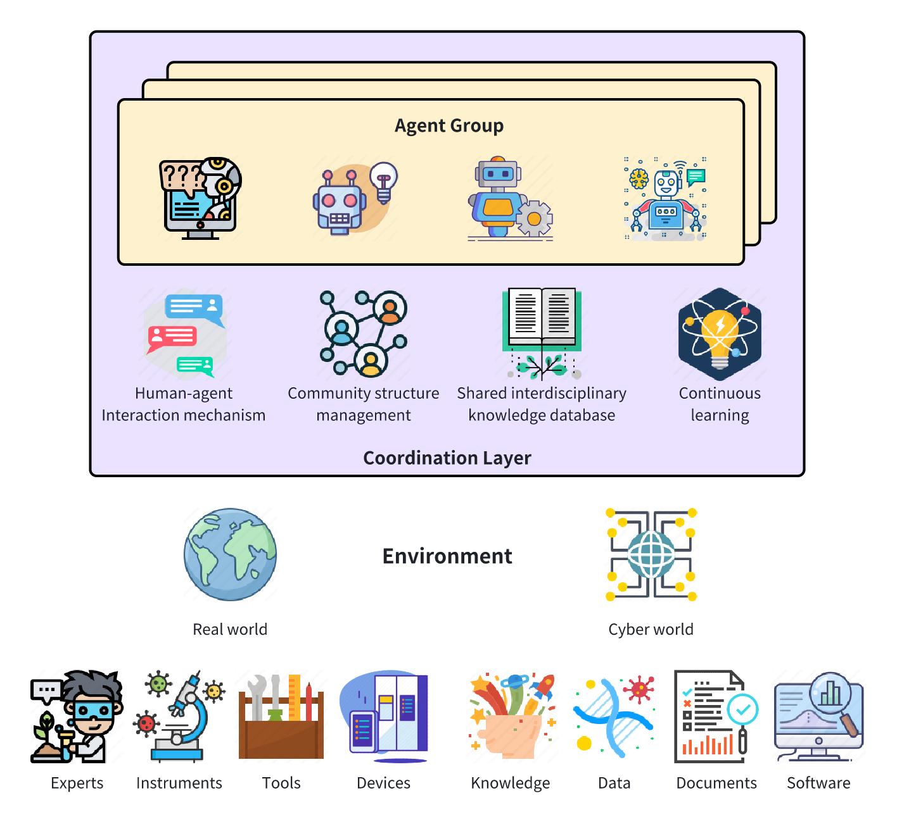

# Bio-MAS

⚡Bio-MAS is a project that provides an available multi-agent system for life sciences under a data-intelligence-intensive scientific research paradigm.⚡ [[Paper Link]]()

## ✨ Latest News
- [xx/xx/2024]: Release the code generated by agent and human for HLCA task.

## 🤔 Dataset
- xxx

## 🎬 Technical Structure

