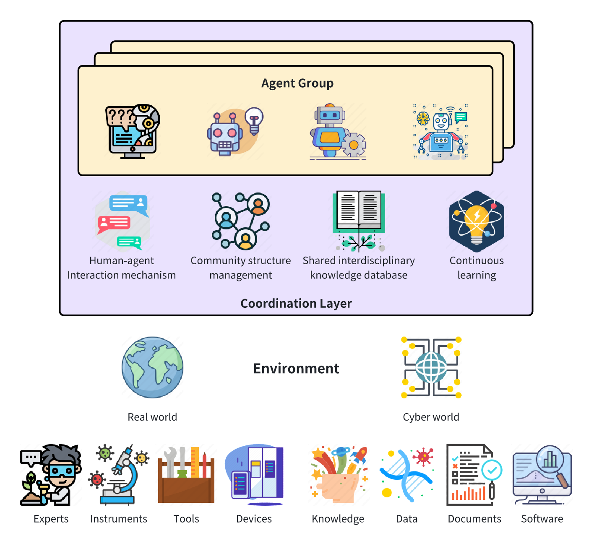
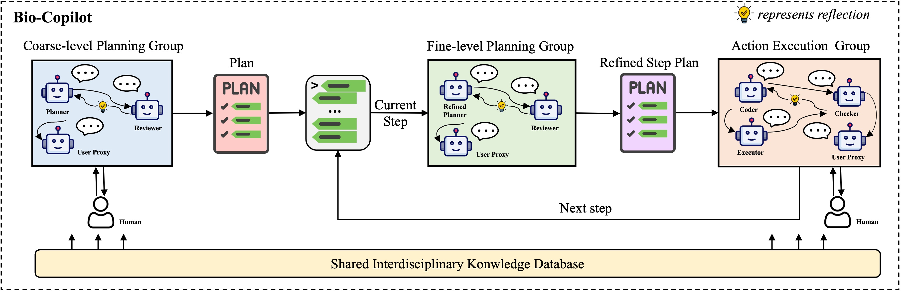

# Bio-Copilot

<div align=center>

</div>

Bio-Copilot is a project that provides an available multi-agent system for large-scale omics analysis under a data-intelligence-intensive scientific research paradigm. The paper is published in Brefings in Bioinformatics. [Paper Link](https://doi.org/10.1093/bib/bbaf312)


## Motivation
- There is no available multi-agent system for complex tasks in the field of bioinformatics. The tasks in bioinformatics are generally characterized by a large amount of personalized data processing, which the existing multi-agent systems cannot handle.
- We believe human researchers are essential for current AI agents. Thus, the Bio-Copilot incorporates humans as an important role.
- Open source code is provided for subsequent researchers to refer to and develop.

## Technical Structure

<div align=center>

</div>

## Data
- Check [HLCA dataset](https://zenodo.org/records/11210015) for the data used in the scANVI integration step.
- Other data used for the cell annotation step is in the 'data' folder.

## Usage
You can run the Bio-Copilot based on the chainlit visual interface with the following line of code (in the 'biocopilot' folder):
```
chainlit run main_biocopilot.py --port=8000
```

In the codebase, main_biocopilot.py is the primary entry point. The groupchats directory contains the agent definitions used in Bio-Copilot. The autogen directory holds the source files of the AutoGEN framework; we have modified autogen/agentchat/groupchat.py to build Bio-Copilot.

We hope this open-source release will assist researchers who extend or study agent systems built on AutoGEN.

## Quick Start

We add a demo prompt in "example_prompt/simple_demo.txt". 

First, please config LLM in "biocopilot/config.py".

Second, run the Bio-Copilot based on the chainlit visual interface.

Third, use the prompt in the simple_demo.txt as the user input.

## Demo
A simple demo of Bio-Copilot is shown as the following:
<video src="[https://github.com/<用户名>/<仓库>/releases/download/v1.0.0/demo.mp4](https://github.com/lyyang01/Bio-Copilot/releases/download/v1.0.0/demo.mp4)" 
       controls="controls" width="100%" muted></video>
